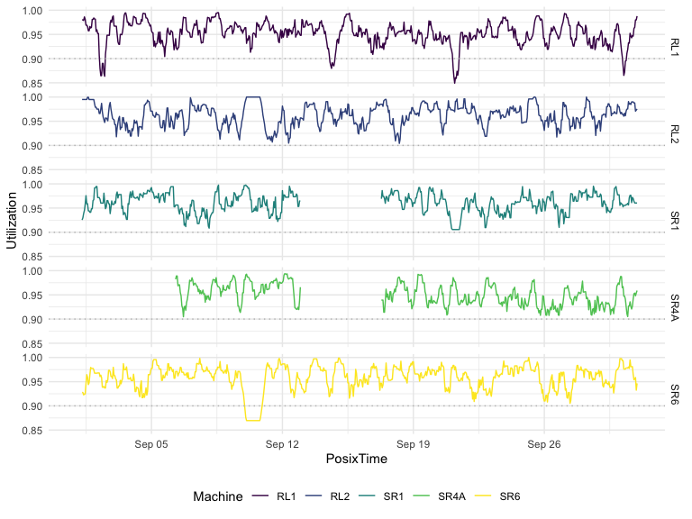

R\_advanced\_P4\_List
================

## Import Data

``` r
coal_mining_df = read_csv("./data/Machine-Utilization.csv")
```

    ## Parsed with column specification:
    ## cols(
    ##   Timestamp = col_character(),
    ##   Machine = col_character(),
    ##   `Percent Idle` = col_double()
    ## )

``` r
head(coal_mining_df, 12)
```

    ## # A tibble: 12 x 3
    ##    Timestamp        Machine `Percent Idle`
    ##    <chr>            <chr>            <dbl>
    ##  1 01/09/2016 00:00 RL1            NA     
    ##  2 01/09/2016 01:00 RL1            NA     
    ##  3 01/09/2016 02:00 RL1            NA     
    ##  4 01/09/2016 03:00 RL1            NA     
    ##  5 01/09/2016 04:00 RL1            NA     
    ##  6 01/09/2016 05:00 RL1            NA     
    ##  7 01/09/2016 06:00 RL1            NA     
    ##  8 01/09/2016 07:00 RL1             0.0199
    ##  9 01/09/2016 08:00 RL1             0.0200
    ## 10 01/09/2016 09:00 RL1             0.0212
    ## 11 01/09/2016 10:00 RL1             0.0138
    ## 12 01/09/2016 11:00 RL1             0.0192

``` r
str(coal_mining_df)
```

    ## tibble [3,600 × 3] (S3: spec_tbl_df/tbl_df/tbl/data.frame)
    ##  $ Timestamp   : chr [1:3600] "01/09/2016 00:00" "01/09/2016 01:00" "01/09/2016 02:00" "01/09/2016 03:00" ...
    ##  $ Machine     : chr [1:3600] "RL1" "RL1" "RL1" "RL1" ...
    ##  $ Percent Idle: num [1:3600] NA NA NA NA NA ...
    ##  - attr(*, "spec")=
    ##   .. cols(
    ##   ..   Timestamp = col_character(),
    ##   ..   Machine = col_character(),
    ##   ..   `Percent Idle` = col_double()
    ##   .. )

``` r
summary(coal_mining_df)
```

    ##   Timestamp           Machine           Percent Idle   
    ##  Length:3600        Length:3600        Min.   :0.0000  
    ##  Class :character   Class :character   1st Qu.:0.0262  
    ##  Mode  :character   Mode  :character   Median :0.0410  
    ##                                        Mean   :0.0431  
    ##                                        3rd Qu.:0.0576  
    ##                                        Max.   :0.1508  
    ##                                        NA's   :361

## Derive utilization column

``` r
coal_mining_df$Utilization = 1 - coal_mining_df$`Percent Idle`

head(coal_mining_df, 12)
```

    ## # A tibble: 12 x 4
    ##    Timestamp        Machine `Percent Idle` Utilization
    ##    <chr>            <chr>            <dbl>       <dbl>
    ##  1 01/09/2016 00:00 RL1            NA           NA    
    ##  2 01/09/2016 01:00 RL1            NA           NA    
    ##  3 01/09/2016 02:00 RL1            NA           NA    
    ##  4 01/09/2016 03:00 RL1            NA           NA    
    ##  5 01/09/2016 04:00 RL1            NA           NA    
    ##  6 01/09/2016 05:00 RL1            NA           NA    
    ##  7 01/09/2016 06:00 RL1            NA           NA    
    ##  8 01/09/2016 07:00 RL1             0.0199       0.980
    ##  9 01/09/2016 08:00 RL1             0.0200       0.980
    ## 10 01/09/2016 09:00 RL1             0.0212       0.979
    ## 11 01/09/2016 10:00 RL1             0.0138       0.986
    ## 12 01/09/2016 11:00 RL1             0.0192       0.981

## Handling Date-Time in R

``` r
tail(coal_mining_df) #make sure the date format: DDMMYY
```

    ## # A tibble: 6 x 4
    ##   Timestamp        Machine `Percent Idle` Utilization
    ##   <chr>            <chr>            <dbl>       <dbl>
    ## 1 30/09/2016 18:00 SR6             0.0349       0.965
    ## 2 30/09/2016 19:00 SR6             0.0461       0.954
    ## 3 30/09/2016 20:00 SR6             0.0443       0.956
    ## 4 30/09/2016 21:00 SR6             0.0414       0.959
    ## 5 30/09/2016 22:00 SR6             0.0675       0.932
    ## 6 30/09/2016 23:00 SR6             0.0536       0.946

``` r
?POSIXct # store time from 1970/1/1
```

    ## Help on topic 'POSIXct' was found in the following packages:
    ## 
    ##   Package               Library
    ##   lubridate             /Library/Frameworks/R.framework/Versions/4.0/Resources/library
    ##   base                  /Library/Frameworks/R.framework/Resources/library
    ## 
    ## 
    ## Using the first match ...

``` r
coal_mining_df$PosixTime = as.POSIXct(coal_mining_df$Timestamp, format = "%d/%m/%Y %H:%M")

head(coal_mining_df, 12)
```

    ## # A tibble: 12 x 5
    ##    Timestamp        Machine `Percent Idle` Utilization PosixTime          
    ##    <chr>            <chr>            <dbl>       <dbl> <dttm>             
    ##  1 01/09/2016 00:00 RL1            NA           NA     2016-09-01 00:00:00
    ##  2 01/09/2016 01:00 RL1            NA           NA     2016-09-01 01:00:00
    ##  3 01/09/2016 02:00 RL1            NA           NA     2016-09-01 02:00:00
    ##  4 01/09/2016 03:00 RL1            NA           NA     2016-09-01 03:00:00
    ##  5 01/09/2016 04:00 RL1            NA           NA     2016-09-01 04:00:00
    ##  6 01/09/2016 05:00 RL1            NA           NA     2016-09-01 05:00:00
    ##  7 01/09/2016 06:00 RL1            NA           NA     2016-09-01 06:00:00
    ##  8 01/09/2016 07:00 RL1             0.0199       0.980 2016-09-01 07:00:00
    ##  9 01/09/2016 08:00 RL1             0.0200       0.980 2016-09-01 08:00:00
    ## 10 01/09/2016 09:00 RL1             0.0212       0.979 2016-09-01 09:00:00
    ## 11 01/09/2016 10:00 RL1             0.0138       0.986 2016-09-01 10:00:00
    ## 12 01/09/2016 11:00 RL1             0.0192       0.981 2016-09-01 11:00:00

``` r
summary(coal_mining_df)
```

    ##   Timestamp           Machine           Percent Idle     Utilization    
    ##  Length:3600        Length:3600        Min.   :0.0000   Min.   :0.8492  
    ##  Class :character   Class :character   1st Qu.:0.0262   1st Qu.:0.9424  
    ##  Mode  :character   Mode  :character   Median :0.0410   Median :0.9590  
    ##                                        Mean   :0.0431   Mean   :0.9569  
    ##                                        3rd Qu.:0.0576   3rd Qu.:0.9738  
    ##                                        Max.   :0.1508   Max.   :1.0000  
    ##                                        NA's   :361      NA's   :361     
    ##    PosixTime                  
    ##  Min.   :2016-09-01 00:00:00  
    ##  1st Qu.:2016-09-08 11:45:00  
    ##  Median :2016-09-15 23:30:00  
    ##  Mean   :2016-09-15 23:30:00  
    ##  3rd Qu.:2016-09-23 11:15:00  
    ##  Max.   :2016-09-30 23:00:00  
    ## 

How to rearrange columns in a df:

``` r
coal_mining_df = coal_mining_df %>%  select(-Timestamp)
coal_mining_df = coal_mining_df[, c(4, 1, 2, 3)]
head(coal_mining_df, 12)
```

    ## # A tibble: 12 x 4
    ##    PosixTime           Machine `Percent Idle` Utilization
    ##    <dttm>              <chr>            <dbl>       <dbl>
    ##  1 2016-09-01 00:00:00 RL1            NA           NA    
    ##  2 2016-09-01 01:00:00 RL1            NA           NA    
    ##  3 2016-09-01 02:00:00 RL1            NA           NA    
    ##  4 2016-09-01 03:00:00 RL1            NA           NA    
    ##  5 2016-09-01 04:00:00 RL1            NA           NA    
    ##  6 2016-09-01 05:00:00 RL1            NA           NA    
    ##  7 2016-09-01 06:00:00 RL1            NA           NA    
    ##  8 2016-09-01 07:00:00 RL1             0.0199       0.980
    ##  9 2016-09-01 08:00:00 RL1             0.0200       0.980
    ## 10 2016-09-01 09:00:00 RL1             0.0212       0.979
    ## 11 2016-09-01 10:00:00 RL1             0.0138       0.986
    ## 12 2016-09-01 11:00:00 RL1             0.0192       0.981

## What is a list?

``` r
summary(coal_mining_df)
```

    ##    PosixTime                     Machine           Percent Idle   
    ##  Min.   :2016-09-01 00:00:00   Length:3600        Min.   :0.0000  
    ##  1st Qu.:2016-09-08 11:45:00   Class :character   1st Qu.:0.0262  
    ##  Median :2016-09-15 23:30:00   Mode  :character   Median :0.0410  
    ##  Mean   :2016-09-15 23:30:00                      Mean   :0.0431  
    ##  3rd Qu.:2016-09-23 11:15:00                      3rd Qu.:0.0576  
    ##  Max.   :2016-09-30 23:00:00                      Max.   :0.1508  
    ##                                                   NA's   :361     
    ##   Utilization    
    ##  Min.   :0.8492  
    ##  1st Qu.:0.9424  
    ##  Median :0.9590  
    ##  Mean   :0.9569  
    ##  3rd Qu.:0.9738  
    ##  Max.   :1.0000  
    ##  NA's   :361

``` r
RL1 = coal_mining_df %>% 
    filter(Machine == "RL1")

RL1$Machine = factor(RL1$Machine)

summary(RL1)
```

    ##    PosixTime                   Machine    Percent Idle      Utilization    
    ##  Min.   :2016-09-01 00:00:00   RL1:720   Min.   :0.00500   Min.   :0.8492  
    ##  1st Qu.:2016-09-08 11:45:00             1st Qu.:0.03208   1st Qu.:0.9403  
    ##  Median :2016-09-15 23:30:00             Median :0.04613   Median :0.9539  
    ##  Mean   :2016-09-15 23:30:00             Mean   :0.04830   Mean   :0.9517  
    ##  3rd Qu.:2016-09-23 11:15:00             3rd Qu.:0.05967   3rd Qu.:0.9679  
    ##  Max.   :2016-09-30 23:00:00             Max.   :0.15077   Max.   :0.9950  
    ##                                          NA's   :7         NA's   :7

## Construct List

Character:RL1 Numeric: Statistics variable (min, mean, median, max)
Logical: TRUE/FALSE

``` r
coal_stats_rl1 = c(min(RL1$Utilization, na.rm = TRUE), 
                   mean(RL1$Utilization, na.rm = TRUE), 
                   median(RL1$Utilization, na.rm = TRUE), 
                   max(RL1$Utilization, na.rm = TRUE))

coal_under_90_flag = length(which(RL1$Utilization < 0.9)) > 0

list_rl1 = list("RL1", coal_stats_rl1, coal_under_90_flag)
```

Naming components of a list:

``` r
names(list_rl1) = c("Machine", "Stats", "LowThreshold")
list_rl1
```

    ## $Machine
    ## [1] "RL1"
    ## 
    ## $Stats
    ## [1] 0.8492262 0.9516976 0.9538690 0.9950000
    ## 
    ## $LowThreshold
    ## [1] TRUE

Another way:

``` r
rm(list_rl1)
list_rl1 = list(Machine = "RL1", 
                Stats = coal_stats_rl1, 
                LowThreshold = coal_under_90_flag)
```

## Extract components `[]` vs. `[[]]`

  - \[\] :will always return a list.

  - 
  - $ : same as [\[\]](will%20always%20return%20the%20actual%20object.)
    but prettier.

<!-- end list -->

``` r
list_rl1[1]
```

    ## $Machine
    ## [1] "RL1"

``` r
list_rl1[[1]]
```

    ## [1] "RL1"

``` r
list_rl1$Machine
```

    ## [1] "RL1"

``` r
list_rl1[2]
```

    ## $Stats
    ## [1] 0.8492262 0.9516976 0.9538690 0.9950000

``` r
typeof(list_rl1[2])
```

    ## [1] "list"

``` r
list_rl1[[2]]
```

    ## [1] 0.8492262 0.9516976 0.9538690 0.9950000

``` r
typeof(list_rl1[[2]])
```

    ## [1] "double"

``` r
list_rl1$Stats
```

    ## [1] 0.8492262 0.9516976 0.9538690 0.9950000

``` r
typeof(list_rl1$Stats)
```

    ## [1] "double"

How to access the 4th value of the vector?

``` r
list_rl1[[2]][4]
```

    ## [1] 0.995

``` r
list_rl1$Stats[4]
```

    ## [1] 0.995

## Add and delete list components

``` r
list_rl1[4] = "New Information"

list_rl1
```

    ## $Machine
    ## [1] "RL1"
    ## 
    ## $Stats
    ## [1] 0.8492262 0.9516976 0.9538690 0.9950000
    ## 
    ## $LowThreshold
    ## [1] TRUE
    ## 
    ## [[4]]
    ## [1] "New Information"

Another way to add:

``` r
list_rl1$UnknownHours = RL1[is.na(RL1$Utilization), "PosixTime"]

list_rl1
```

    ## $Machine
    ## [1] "RL1"
    ## 
    ## $Stats
    ## [1] 0.8492262 0.9516976 0.9538690 0.9950000
    ## 
    ## $LowThreshold
    ## [1] TRUE
    ## 
    ## [[4]]
    ## [1] "New Information"
    ## 
    ## $UnknownHours
    ## # A tibble: 7 x 1
    ##   PosixTime          
    ##   <dttm>             
    ## 1 2016-09-01 00:00:00
    ## 2 2016-09-01 01:00:00
    ## 3 2016-09-01 02:00:00
    ## 4 2016-09-01 03:00:00
    ## 5 2016-09-01 04:00:00
    ## 6 2016-09-01 05:00:00
    ## 7 2016-09-01 06:00:00

Remove a component with the NULL method.

``` r
list_rl1[4] = NULL

list_rl1
```

    ## $Machine
    ## [1] "RL1"
    ## 
    ## $Stats
    ## [1] 0.8492262 0.9516976 0.9538690 0.9950000
    ## 
    ## $LowThreshold
    ## [1] TRUE
    ## 
    ## $UnknownHours
    ## # A tibble: 7 x 1
    ##   PosixTime          
    ##   <dttm>             
    ## 1 2016-09-01 00:00:00
    ## 2 2016-09-01 01:00:00
    ## 3 2016-09-01 02:00:00
    ## 4 2016-09-01 03:00:00
    ## 5 2016-09-01 04:00:00
    ## 6 2016-09-01 05:00:00
    ## 7 2016-09-01 06:00:00

\!\!Notice: numeration has shifted.

``` r
list_rl1[4]
```

    ## $UnknownHours
    ## # A tibble: 7 x 1
    ##   PosixTime          
    ##   <dttm>             
    ## 1 2016-09-01 00:00:00
    ## 2 2016-09-01 01:00:00
    ## 3 2016-09-01 02:00:00
    ## 4 2016-09-01 03:00:00
    ## 5 2016-09-01 04:00:00
    ## 6 2016-09-01 05:00:00
    ## 7 2016-09-01 06:00:00

Add another component: Data Frame : For this machine.

``` r
list_rl1$Data = RL1
summary(list_rl1)
```

    ##              Length Class  Mode     
    ## Machine      1      -none- character
    ## Stats        4      -none- numeric  
    ## LowThreshold 1      -none- logical  
    ## UnknownHours 1      tbl_df list     
    ## Data         4      tbl_df list

``` r
str(list_rl1)
```

    ## List of 5
    ##  $ Machine     : chr "RL1"
    ##  $ Stats       : num [1:4] 0.849 0.952 0.954 0.995
    ##  $ LowThreshold: logi TRUE
    ##  $ UnknownHours: tibble [7 × 1] (S3: tbl_df/tbl/data.frame)
    ##   ..$ PosixTime: POSIXct[1:7], format: "2016-09-01 00:00:00" "2016-09-01 01:00:00" ...
    ##  $ Data        : tibble [720 × 4] (S3: tbl_df/tbl/data.frame)
    ##   ..$ PosixTime   : POSIXct[1:720], format: "2016-09-01 00:00:00" "2016-09-01 01:00:00" ...
    ##   ..$ Machine     : Factor w/ 1 level "RL1": 1 1 1 1 1 1 1 1 1 1 ...
    ##   ..$ Percent Idle: num [1:720] NA NA NA NA NA ...
    ##   ..$ Utilization : num [1:720] NA NA NA NA NA ...

## Subset a list

``` r
list_rl1[[4]][1]
```

    ## # A tibble: 7 x 1
    ##   PosixTime          
    ##   <dttm>             
    ## 1 2016-09-01 00:00:00
    ## 2 2016-09-01 01:00:00
    ## 3 2016-09-01 02:00:00
    ## 4 2016-09-01 03:00:00
    ## 5 2016-09-01 04:00:00
    ## 6 2016-09-01 05:00:00
    ## 7 2016-09-01 06:00:00

``` r
list_rl1$UnknownHours[1]
```

    ## # A tibble: 7 x 1
    ##   PosixTime          
    ##   <dttm>             
    ## 1 2016-09-01 00:00:00
    ## 2 2016-09-01 01:00:00
    ## 3 2016-09-01 02:00:00
    ## 4 2016-09-01 03:00:00
    ## 5 2016-09-01 04:00:00
    ## 6 2016-09-01 05:00:00
    ## 7 2016-09-01 06:00:00

``` r
list_rl1[1:3]
```

    ## $Machine
    ## [1] "RL1"
    ## 
    ## $Stats
    ## [1] 0.8492262 0.9516976 0.9538690 0.9950000
    ## 
    ## $LowThreshold
    ## [1] TRUE

``` r
list_rl1[c(1, 4)]
```

    ## $Machine
    ## [1] "RL1"
    ## 
    ## $UnknownHours
    ## # A tibble: 7 x 1
    ##   PosixTime          
    ##   <dttm>             
    ## 1 2016-09-01 00:00:00
    ## 2 2016-09-01 01:00:00
    ## 3 2016-09-01 02:00:00
    ## 4 2016-09-01 03:00:00
    ## 5 2016-09-01 04:00:00
    ## 6 2016-09-01 05:00:00
    ## 7 2016-09-01 06:00:00

``` r
sublist_rl1 = list_rl1[c("Machine", "Stats")]
sublist_rl1[[2]][2]
```

    ## [1] 0.9516976

``` r
sublist_rl1$Stats[2]
```

    ## [1] 0.9516976

Double Square Brackets Are NOT for subsetting: list\_rl1\[\[1:3\]\] -\>
ERROR

## Building a timeseries plot

``` r
plot1 = coal_mining_df %>% 
    ggplot(aes(x = PosixTime, y = Utilization)) + 
    geom_line(aes(color = Machine)) +
    facet_grid(Machine ~.) +
    geom_hline(yintercept = 0.90, color = "Gray", linetype = 3)

list_rl1$Plot = plot1
list_rl1
```

    ## $Machine
    ## [1] "RL1"
    ## 
    ## $Stats
    ## [1] 0.8492262 0.9516976 0.9538690 0.9950000
    ## 
    ## $LowThreshold
    ## [1] TRUE
    ## 
    ## $UnknownHours
    ## # A tibble: 7 x 1
    ##   PosixTime          
    ##   <dttm>             
    ## 1 2016-09-01 00:00:00
    ## 2 2016-09-01 01:00:00
    ## 3 2016-09-01 02:00:00
    ## 4 2016-09-01 03:00:00
    ## 5 2016-09-01 04:00:00
    ## 6 2016-09-01 05:00:00
    ## 7 2016-09-01 06:00:00
    ## 
    ## $Data
    ## # A tibble: 720 x 4
    ##    PosixTime           Machine `Percent Idle` Utilization
    ##    <dttm>              <fct>            <dbl>       <dbl>
    ##  1 2016-09-01 00:00:00 RL1            NA           NA    
    ##  2 2016-09-01 01:00:00 RL1            NA           NA    
    ##  3 2016-09-01 02:00:00 RL1            NA           NA    
    ##  4 2016-09-01 03:00:00 RL1            NA           NA    
    ##  5 2016-09-01 04:00:00 RL1            NA           NA    
    ##  6 2016-09-01 05:00:00 RL1            NA           NA    
    ##  7 2016-09-01 06:00:00 RL1            NA           NA    
    ##  8 2016-09-01 07:00:00 RL1             0.0199       0.980
    ##  9 2016-09-01 08:00:00 RL1             0.0200       0.980
    ## 10 2016-09-01 09:00:00 RL1             0.0212       0.979
    ## # … with 710 more rows
    ## 
    ## $Plot


